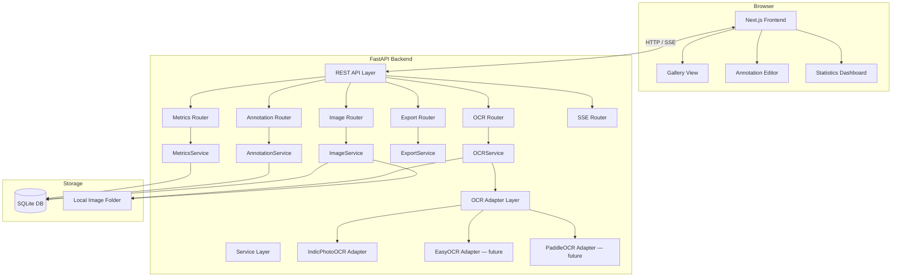

# Design Document

## Marathi Scene Text Annotation Platform

---

## Overview

The Marathi Scene Text Annotation Platform is a web-based Human-in-the-Loop OCR annotation tool for creating Marathi scene text datasets. The system follows a client-server architecture: a **Next.js + TypeScript + TailwindCSS** frontend communicates with a **FastAPI + Python** backend over a REST API. Images are stored in a local folder on disk, and all annotation data is persisted in **SQLite** via SQLAlchemy's async ORM.

The workflow is: upload images → trigger OCR auto-annotation (IndicPhotoOCR) → review/correct bounding boxes and transcriptions on an interactive canvas → approve → export in standard research formats. A research metrics module tracks AAR, BCR, MAR, and TSE to quantify the efficiency benefit of OCR-assisted annotation over fully manual work.

**Key design decisions:**

- **Konva.js / react-konva** is chosen for the canvas layer. It provides built-in drag, resize handle, and event support on top of HTML5 Canvas, which avoids re-implementing hit-testing and transform math from scratch.
- **SQLAlchemy 2.0 async** with `aiosqlite` is used for non-blocking I/O, keeping FastAPI's event loop free during database queries.
- **OCR adapter pattern** decouples the frontend entirely from the choice of OCR engine; adding EasyOCR or PaddleOCR requires only a new adapter class in the backend.
- **Server-Sent Events (SSE)** propagate status changes (OCR completion, approval) to the gallery in real time without polling or WebSocket overhead.

---

## Architecture



### Request Flow (OCR annotation)

```
Annotator clicks "Run OCR"
  → POST /api/ocr/{image_id}
    → OCRService validates image status
    → OCRService dispatches to active OCRAdapter (IndicPhotoOCR)
    → OCR runs (≤60 s timeout enforced by asyncio.wait_for)
    → Results normalised to OCRResult list
    → AnnotationService bulk-inserts Annotation rows
    → ImageService sets status = OCR_Completed
    → SSE event pushed to connected clients
  ← 200 { annotations: [...] }
```

---

## Components and Interfaces

### Backend

#### OCR Adapter Interface

All OCR engines implement a single abstract class:

```python
from abc import ABC, abstractmethod
from dataclasses import dataclass
from typing import Sequence

@dataclass
class OCRResult:
    text: str
    x1: float
    y1: float
    x2: float
    y2: float
    confidence: float   # in [0.0, 1.0]

class BaseOCRAdapter(ABC):
    @abstractmethod
    async def run(self, image_path: str) -> Sequence[OCRResult]:
        """Accept a local image path, return detected text regions."""
        ...
```

`IndicPhotoOCRAdapter` wraps the library call in `asyncio.get_event_loop().run_in_executor` so the CPU-bound model inference does not block the event loop. The adapter uses the modular pipeline (detect → identify → recognise with `return_confidence=True`) to obtain per-word confidence scores.

#### REST API Endpoints

| Method | Path | Description |
|--------|------|-------------|
| `POST` | `/api/images/upload` | Upload one or more image files |
| `GET` | `/api/images` | List all images with status |
| `GET` | `/api/images/{image_id}` | Get single image metadata |
| `PATCH` | `/api/images/{image_id}/status` | Transition workflow state |
| `POST` | `/api/ocr/{image_id}` | Trigger OCR; returns annotations |
| `GET` | `/api/annotations/{image_id}` | Get all annotations for image |
| `POST` | `/api/annotations/{image_id}` | Create manual annotation |
| `PATCH` | `/api/annotations/{annotation_id}` | Update text / label / accepted |
| `DELETE` | `/api/annotations/{annotation_id}` | Soft-delete annotation |
| `GET` | `/api/metrics/{image_id}` | Per-image metrics (AAR, BCR, MAR, TSE) |
| `GET` | `/api/metrics/project` | Project-level aggregate metrics |
| `GET` | `/api/export/{image_id}` | Export single image in given format |
| `GET` | `/api/export/project` | Export entire project in given format |
| `GET` | `/api/events` | SSE stream for status updates |

**Export format** is passed as a query parameter: `?format=yolo|coco|labelstudio|custom_json`. An optional `?status=Approved` filter is supported on project exports.

#### Service Layer

**ImageService** — handles file I/O (validates MIME type with `python-magic`, saves to `IMAGES_DIR`), creates `Image` DB rows, drives status transitions.

**AnnotationService** — CRUD for `Annotation` rows, tracks `is_corrected` flag when OCR-generated text/label is modified, triggers `MetricsService.recompute` after every mutation.

**OCRService** — resolves the active adapter from config, enforces the 60 s timeout, normalises raw output to `OCRResult`, delegates persistence to `AnnotationService`.

**ExportService** — implements four serialisers; each takes a list of `(Image, [Annotation])` tuples and returns bytes or a string. YOLO normalises coordinates by image width/height; COCO constructs the full schema; Label Studio builds the `RectangleLabels` task structure; Custom JSON serialises all ORM fields.

**MetricsService** — pure computation functions operating on in-memory data fetched from the DB. Triggered synchronously after writes so statistics are always fresh.

### Frontend

#### Page Layout

```
┌─────────────────────────────────────────────────────────┐
│  Top Toolbar: [Upload] [Run OCR] [Save] [Export] [Stats] │
├──────────────┬────────────────────────┬──────────────────┤
│              │                        │                  │
│  Image       │   Canvas               │  Annotation      │
│  Gallery     │   (react-konva)        │  Panel           │
│              │                        │  (text, label,   │
│  thumbnail   │   bounding boxes       │   confidence,    │
│  filename    │   colour-coded         │   accepted)      │
│  status      │                        │                  │
│              │                        │                  │
└──────────────┴────────────────────────┴──────────────────┘
```

#### Canvas Component (react-konva)

The `AnnotationCanvas` component maintains:

- A `Stage` containing two `Layer`s: one for the background `Image` node, one for annotation shapes.
- Each annotation is a `Rect` + `Transformer` node. Border stroke colour derives from `confidence`:
  - `> 0.95` → `#22c55e` (green)
  - `[0.80, 0.95]` → `#eab308` (yellow)
  - `< 0.80` → `#ef4444` (red)
- **Draw mode**: `mousedown` on empty canvas area creates a temporary `Rect` that tracks `mousemove`; `mouseup` finalises it and fires `onAnnotationCreate`.
- **Select mode**: clicking an existing box fires `onAnnotationSelect`; the `Transformer` handles resize handles and emits `onAnnotationUpdate` on `transformend`. Dragging fires `onAnnotationUpdate` on `dragend`.
- Deleting the selected box via `Delete` key or a panel button fires `onAnnotationDelete`.

#### State Management

Client state is managed with **React Query** (server state: images, annotations, metrics) and **Zustand** (UI state: selected annotation ID, canvas mode, confidence filter). This avoids prop drilling while keeping server cache invalidation straightforward.

---

## Data Models

### SQLite Schema

```sql
CREATE TABLE images (
    id          INTEGER PRIMARY KEY AUTOINCREMENT,
    filename    TEXT NOT NULL,
    filepath    TEXT NOT NULL,
    width       INTEGER NOT NULL,
    height      INTEGER NOT NULL,
    status      TEXT NOT NULL DEFAULT 'Uploaded',
    upload_date DATETIME NOT NULL DEFAULT CURRENT_TIMESTAMP,
    approved_at DATETIME
);

CREATE TABLE annotations (
    id              INTEGER PRIMARY KEY AUTOINCREMENT,
    image_id        INTEGER NOT NULL REFERENCES images(id),
    x1              REAL NOT NULL,
    y1              REAL NOT NULL,
    x2              REAL NOT NULL,
    y2              REAL NOT NULL,
    text            TEXT NOT NULL DEFAULT '',
    label           TEXT NOT NULL DEFAULT 'Marathi',
    confidence      REAL NOT NULL DEFAULT 1.0,
    accepted        INTEGER NOT NULL DEFAULT 0,   -- 0 = false, 1 = true
    ocr_generated   INTEGER NOT NULL DEFAULT 0,   -- distinguishes OCR vs manual
    is_corrected    INTEGER NOT NULL DEFAULT 0,   -- set when text/label edited post-OCR
    is_deleted      INTEGER NOT NULL DEFAULT 0,   -- soft delete
    created_at      DATETIME NOT NULL DEFAULT CURRENT_TIMESTAMP,
    updated_at      DATETIME NOT NULL DEFAULT CURRENT_TIMESTAMP
);
```

**Notes:**
- `ocr_generated = 1` identifies rows created by an OCR run; `ocr_generated = 0` identifies manually drawn boxes. This distinction is required for AAR, BCR, and MAR calculations.
- `is_deleted = 1` is a soft delete; deleted annotations are excluded from exports and metrics but retained for audit purposes.
- `confidence` is stored as a REAL in [0.0, 1.0]; manual annotations default to 1.0.
- `label` is constrained to the set `{'Marathi', 'English', 'Numeric', 'Mixed', 'Logo'}` at the application layer (Pydantic validator), not at the SQLite layer.

### SQLAlchemy ORM Models (Python)

```python
class Image(Base):
    __tablename__ = "images"
    id: Mapped[int] = mapped_column(primary_key=True)
    filename: Mapped[str]
    filepath: Mapped[str]
    width: Mapped[int]
    height: Mapped[int]
    status: Mapped[str] = mapped_column(default="Uploaded")
    upload_date: Mapped[datetime] = mapped_column(default=datetime.utcnow)
    approved_at: Mapped[Optional[datetime]]
    annotations: Mapped[list["Annotation"]] = relationship(back_populates="image")

class Annotation(Base):
    __tablename__ = "annotations"
    id: Mapped[int] = mapped_column(primary_key=True)
    image_id: Mapped[int] = mapped_column(ForeignKey("images.id"))
    x1: Mapped[float]
    y1: Mapped[float]
    x2: Mapped[float]
    y2: Mapped[float]
    text: Mapped[str] = mapped_column(default="")
    label: Mapped[str] = mapped_column(default="Marathi")
    confidence: Mapped[float] = mapped_column(default=1.0)
    accepted: Mapped[bool] = mapped_column(default=False)
    ocr_generated: Mapped[bool] = mapped_column(default=False)
    is_corrected: Mapped[bool] = mapped_column(default=False)
    is_deleted: Mapped[bool] = mapped_column(default=False)
    created_at: Mapped[datetime] = mapped_column(default=datetime.utcnow)
    updated_at: Mapped[datetime] = mapped_column(default=datetime.utcnow)
    image: Mapped["Image"] = relationship(back_populates="annotations")
```

### Pydantic Schemas (API layer)

```python
class AnnotationCreate(BaseModel):
    x1: float
    y1: float
    x2: float
    y2: float
    text: str = ""
    label: Literal["Marathi","English","Numeric","Mixed","Logo"] = "Marathi"

class AnnotationUpdate(BaseModel):
    text: Optional[str] = None
    label: Optional[Literal["Marathi","English","Numeric","Mixed","Logo"]] = None
    accepted: Optional[bool] = None

class AnnotationResponse(BaseModel):
    id: int
    image_id: int
    x1: float; y1: float; x2: float; y2: float
    text: str
    label: str
    confidence: float
    accepted: bool
    ocr_generated: bool
    is_corrected: bool

class MetricsResponse(BaseModel):
    image_id: int
    aar: Optional[float]   # null when no OCR annotations
    bcr: Optional[float]
    mar: Optional[float]
    tse: Optional[float]   # seconds
    total_ocr: int
    total_annotations: int

class ProjectMetricsResponse(BaseModel):
    total_images: int
    total_annotations: int
    average_confidence: float
    mean_aar: Optional[float]
    mean_bcr: Optional[float]
    mean_mar: Optional[float]
    mean_tse: Optional[float]
```

---

## Correctness Properties

*A property is a characteristic or behavior that should hold true across all valid executions of a system — essentially, a formal statement about what the system should do. Properties serve as the bridge between human-readable specifications and machine-verifiable correctness guarantees.*

### Property 1: Custom JSON export round-trip

*For any* set of Annotations belonging to an Image, serialising them to Custom JSON and deserialising the result must yield objects with identical field values (`id`, `image_id`, `x1`, `y1`, `x2`, `y2`, `text`, `label`, `confidence`, `accepted`).

**Validates: Requirements 9.4, 9.7**

---

### Property 2: YOLO coordinate normalisation is in bounds

*For any* Annotation with coordinates (x1, y1, x2, y2) on an Image of dimensions (W, H > 0), the YOLO export line must have `x_center`, `y_center`, `width`, and `height` all in the range [0.0, 1.0].

**Validates: Requirements 9.1**

---

### Property 3: Research metrics formula correctness

*For any* Image with a collection of Annotations (with varying `accepted`, `is_corrected`, `ocr_generated`, `is_deleted` flag combinations):
- `AAR = (accepted OCR annotations) / (total OCR annotations)` and lies in [0.0, 1.0]; is `null` when total OCR annotations = 0.
- `BCR = (is_corrected OCR annotations) / (total OCR annotations)` and lies in [0.0, 1.0]; is `null` when total OCR annotations = 0.
- `MAR = (manually added annotations) / (total non-deleted annotations)` and lies in [0.0, 1.0]; is `null` when total non-deleted annotations = 0.

*Note: BCR and AAR share the same denominator, so consolidating into one property avoids three near-identical tests.*

**Validates: Requirements 8.1, 8.2, 8.3**

---

### Property 4: TSE is derived from AAR

*For any* AAR value in [0.0, 1.0], `TSE = AAR × 579` must hold exactly (within floating-point tolerance).

**Validates: Requirements 8.4**

---

### Property 5: Confidence colour tier assignment is total and consistent

*For any* confidence value in [0.0, 1.0], the tier assignment function must return exactly one tier, and that tier must be consistent with the thresholds: green when confidence > 0.95, yellow when confidence is in [0.80, 0.95], red when confidence < 0.80.

**Validates: Requirements 3.7, 5.1**

---

### Property 6: Approved-only export contains no unapproved annotations

*For any* collection of Images with varying `Annotation_Status` values and associated Annotations, an export filtered to `status=Approved` must contain only Annotations whose parent Image has `status == 'Approved'`.

**Validates: Requirements 9.5**

---

### Property 7: Manual annotations always have confidence 1.0 and accepted true

*For any* bounding box coordinates drawn manually by an Annotator, the resulting Annotation record must have `confidence == 1.0` and `accepted == true`.

**Validates: Requirements 3.6**

---

### Property 8: OCR annotation modification sets is_corrected

*For any* OCR-generated Annotation (where `ocr_generated == true`), modifying either its `text` or `label` field must result in `is_corrected == true` being set on that Annotation.

**Validates: Requirements 4.4**

---

### Property 9: Annotation field updates are persisted and retrievable

*For any* Annotation and any valid `text` string or valid `label` value (from the allowed set), updating that field and then retrieving the Annotation from the database must return the updated value.

*Note: Properties 4.2 and 4.3 are merged here since they test the same persistence round-trip pattern for different fields.*

**Validates: Requirements 4.2, 4.3**

---

### Property 10: Confidence tier filter returns only matching annotations

*For any* collection of Annotations and any selected confidence tier (green/yellow/red), the filter must return all and only Annotations whose confidence value belongs to that tier.

**Validates: Requirements 5.3**

---

### Property 11: Image status is always a valid enum value

*For any* sequence of operations applied to an Image (upload, OCR, open for editing, approve, re-open), the `Annotation_Status` field must always be one of `{Uploaded, OCR_Completed, Under_Review, Approved}`.

**Validates: Requirements 6.1**

---

### Property 12: Approved image modifications are rejected

*For any* Annotation belonging to an Image with `status == Approved`, any attempt to create, update, or delete that Annotation (without first re-opening the Image) must be rejected by the platform.

**Validates: Requirements 6.4**

---

### Property 13: Statistics are consistent after any annotation mutation

*For any* Image, after any combination of annotation create, modify, or delete operations, the per-image statistics (AAR, BCR, MAR, TSE, total counts) must equal the values computed by applying the metric formulas to the current set of non-deleted annotations.

**Validates: Requirements 7.4, 8.6**

---

### Property 14: OCR failure preserves image status

*For any* Image in any valid pre-OCR status (`Uploaded` or `Under_Review`), if the OCR process fails or times out, the Image's `Annotation_Status` must remain unchanged.

**Validates: Requirements 2.5**

---

### Property 15: OCR annotation count equals OCR detection count

*For any* OCR run that returns N detected text regions, exactly N Annotation records must be created for that Image (assuming none are rejected or duplicated).

**Validates: Requirements 2.2**

---

### Property 16: Annotation restoration on revisit

*For any* Image with persisted Annotations, loading that Image in the annotation editor must render every non-deleted Annotation that was previously saved to the database.

**Validates: Requirements 10.4**

---

## Error Handling

### Image Upload Errors
- **Unsupported MIME type**: Backend validates with `python-magic` (not filename extension). Returns HTTP 422 with a message identifying the rejected file. The batch continues processing remaining files.
- **File system write failure**: Returns HTTP 500 with a descriptive message; no DB record is created for that file.
- **Oversized files**: A configurable `MAX_FILE_SIZE_MB` (default 20 MB) is enforced; exceeding files return HTTP 413.

### OCR Errors
- **Engine timeout** (>60 s): `asyncio.wait_for` raises `asyncio.TimeoutError`; the service catches it, returns HTTP 504 with message "OCR timed out after 60 seconds". Image status is unchanged.
- **Engine exception**: Any unhandled exception from the adapter is caught, logged at ERROR level, and returned as HTTP 502 with the error detail. Image status is unchanged.
- **No detections returned**: Valid outcome; zero Annotation rows are inserted, status advances to `OCR_Completed`, canvas renders empty.

### Database Write Failures
- Wrapped in a try/except at the service layer. On failure, the transaction is rolled back, and HTTP 500 is returned with the error message. The frontend retains unsaved UI state and shows a retry prompt (Requirement 10.3).

### Export Errors
- **Zero matching annotations**: Returns an empty but schema-valid file (empty COCO `annotations` array, empty YOLO file, etc.) plus a 200 response with header `X-Empty-Export: true`. The frontend displays a warning toast.

### Workflow State Validation
- Illegal transitions (e.g., `Uploaded → Approved` without an OCR step) are rejected with HTTP 409 Conflict. The allowed state machine is:

```
Uploaded → OCR_Completed → Under_Review → Approved → Under_Review (re-open)
```

---

## Testing Strategy

### Unit Tests (pytest)

Focus areas:
- `MetricsService`: verify AAR, BCR, MAR, TSE formulas with concrete examples and boundary values (0 OCR annotations → null; all accepted → AAR = 1.0).
- `ExportService`: verify each serialiser with a known set of annotations; assert schema validity for COCO and Label Studio outputs.
- `ImageService.validate_mime_type`: test accepted and rejected types.
- `OCRAdapter`: test that `IndicPhotoOCRAdapter.run` correctly maps library output to `OCRResult` objects using a mocked library call.
- Confidence colour tier function: test the three branches and boundary values (0.80, 0.95).

### Property-Based Tests (Hypothesis, Python)

Each property test runs a minimum of **100 iterations**. The tag format for each test is:
`# Feature: marathi-scene-text-annotation-platform, Property {N}: {property_text}`

- **Property 1** (`test_custom_json_roundtrip`): Generate random `AnnotationResponse` objects, serialise via `ExportService.to_custom_json`, parse back, assert field equality.
- **Property 2** (`test_yolo_coordinates_in_bounds`): Generate random annotations with valid coordinates and image dimensions (W, H > 0), assert all four YOLO values in [0.0, 1.0].
- **Property 3** (`test_metrics_formula_correctness`): Generate random lists of `Annotation` objects (varying `accepted`, `is_corrected`, `ocr_generated`, `is_deleted` flags), assert AAR/BCR/MAR are in [0.0, 1.0] or null, assert null exactly when the respective denominator is 0.
- **Property 4** (`test_tse_derived_from_aar`): Generate random valid AAR values (floats in [0.0, 1.0]), assert TSE equals AAR × 579 within floating-point tolerance.
- **Property 5** (`test_confidence_tier_total_and_consistent`): Generate random confidence floats in [0.0, 1.0], assert exactly one tier matches and the tier is consistent with the thresholds.
- **Property 6** (`test_approved_export_filter`): Generate random lists of `(Image, [Annotation])` with varying statuses, export with `status=Approved`, assert every annotation in output has `image.status == 'Approved'`.
- **Property 7** (`test_manual_annotation_defaults`): Generate random bounding box coordinates, create manual annotations, assert `confidence == 1.0` and `accepted == True` for each.
- **Property 8** (`test_ocr_correction_sets_flag`): Generate random text/label modifications on OCR-generated annotations, assert `is_corrected` is set to `True` after each modification.
- **Property 9** (`test_annotation_field_persistence`): Generate random valid text and label values, update annotations, retrieve from DB, assert stored values match inputs.
- **Property 10** (`test_confidence_filter_correctness`): Generate random annotation sets and tier selections, apply filter, assert all results belong to selected tier and no results from other tiers appear.
- **Property 11** (`test_status_always_valid_enum`): Apply random valid operation sequences to images, assert status is always one of `{Uploaded, OCR_Completed, Under_Review, Approved}`.
- **Property 12** (`test_approved_blocks_mutations`): Generate random annotation mutations targeting approved images, assert each is rejected.
- **Property 13** (`test_statistics_consistency_after_mutation`): Generate random annotation mutation sequences, assert computed stats always equal the expected formula applied to current annotation state.
- **Property 14** (`test_ocr_failure_preserves_status`): Simulate OCR failures (timeout, exception) on images in each valid pre-OCR status, assert status is unchanged afterward.
- **Property 15** (`test_ocr_annotation_count`): Generate random OCR result lists of length N, run through annotation creation, assert exactly N annotation records exist.
- **Property 16** (`test_annotation_restoration`): Create random annotation sets, persist to DB, simulate navigation away and back, assert all non-deleted annotations are restored.

### Integration Tests (pytest + httpx AsyncClient)

- Upload → OCR → retrieve annotations end-to-end with a real SQLite test DB and a mocked OCR adapter.
- Approve workflow: attempt edit on Approved image → expect 403; re-open → edit → expect 200.
- Export endpoints: full pipeline then export, validate response structure.
- SSE endpoint: connect and trigger an OCR run; assert event is received within timeout.

### Frontend Tests (Vitest + React Testing Library)

- Gallery renders correct status badges for each `Annotation_Status` value.
- Annotation panel populates fields when a box is selected.
- Confidence tier displays the correct colour class.
- Toolbar disables OCR/Save/Export when no image is selected.
- Canvas interactions are tested via Konva test utilities: draw, move, delete.
