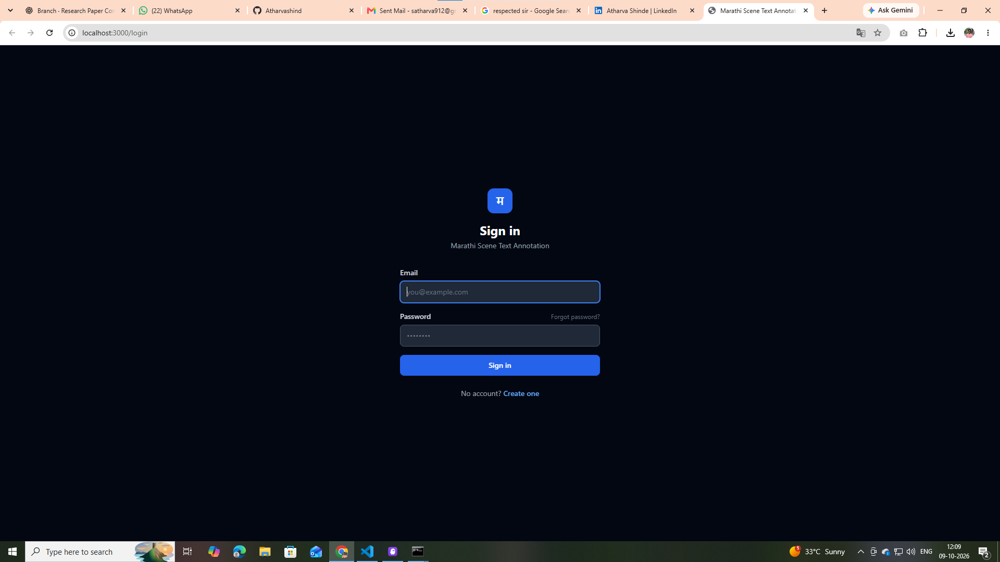
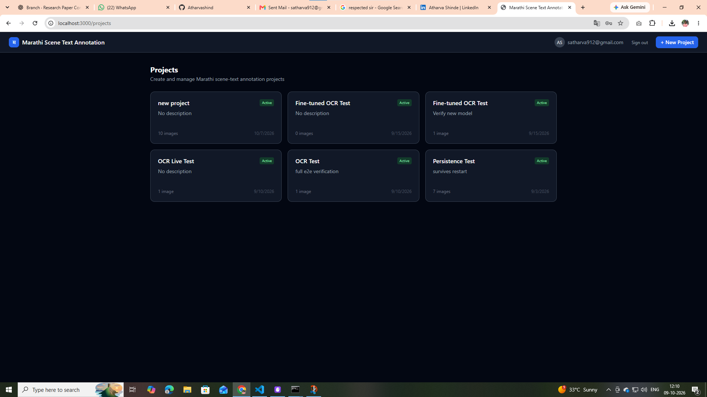
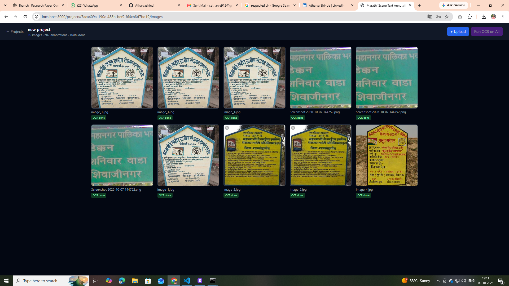
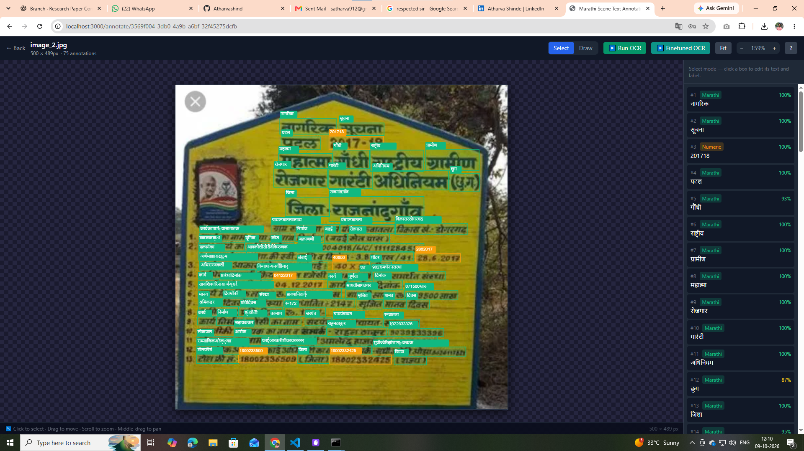

# Marathi Scene Text Annotation Platform

A human-in-the-loop OCR annotation tool for Marathi scene text datasets, combining IndicPhotoOCR and a custom fine-tuned PARSeq recogniser trained on Marathi signboard images.

---

## Screenshots

**Sign in**


**Project dashboard**


**Image gallery with batch OCR**


**Annotation canvas — Run OCR + Finetuned OCR**


---

## Project Structure

```
D:\AUS_TEXT\
│
├── app/                          ← Web application (run this)
│   ├── backend/
│   │   └── main_minimal.py       ← FastAPI server (SQLite, JWT auth)
│   ├── frontend/                 ← Next.js 14 UI
│   └── start.bat                 ← Double-click to start everything
│
├── models/                       ← Trained model checkpoints
│   ├── marathi_finetuned.ckpt    ← Fine-tuned on Marathi25K (94.96% acc)
│   └── marathi_combined.ckpt     ← Further fine-tuned on MahaSTR
│
├── android/                      ← Android deployment assets
│   ├── marathi_finetuned_trace.pt   ← TorchScript export
│   ├── marathi_finetuned.onnx       ← ONNX export (experimental)
│   ├── model_contract.json          ← Input/output spec + token table
│   ├── decode_example.py            ← Minimal decode demo
│   ├── export_android_model.py      ← Re-export script
│   └── validate_android_export.py   ← Validation script
│
├── training/                     ← Training & evaluation scripts
│   ├── finetune.py               ← Sequential fine-tuning (MahaSTR)
│   ├── benchmark.py              ← Baseline benchmark
│   ├── benchmark_finetuned.py    ← Finetuned model benchmark
│   ├── benchmark_compare.py      ← Side-by-side comparison
│   └── results/                  ← Saved benchmark outputs
│
├── docs/
│   └── screenshots/              ← Platform screenshots
│
├── IndicPhotoOCR/                ← External library (Bhashini-IITJ)
├── Marathi25K/                   ← Training dataset
├── MahaSTR/                      ← Fine-tuning dataset
└── train_env/                    ← Python virtual environment
```

---

## Quick Start

```bat
cd D:\AUS_TEXT\app
start.bat
```

Opens:
- **App** → http://localhost:3000 (sign up / sign in, then manage projects)
- **API Docs** → http://localhost:8000/docs

---

## Features

- **Authentication** — JWT-based sign up / sign in, per-session access
- **Project management** — Create projects, upload Marathi signboard images
- **Annotation canvas** — Zoom, pan, draw bounding boxes, edit labels and transcriptions
- **Two OCR engines** on every image:
  - **▶ Run OCR** — IndicPhotoOCR stock pipeline (detect + identify script + recognise)
  - **▶ Finetuned OCR** — Same detector, custom PARSeq recogniser fine-tuned on Marathi25K
- **Batch OCR** — Run OCR on all uploaded images in a project at once, with live progress
- **Export** — YOLO, COCO, JSON annotation export

---

## OCR Model Accuracy (Marathi25K test set)

| Model | Word Accuracy | CER |
|-------|:---:|:---:|
| Original `marathi.ckpt` (IndicPhotoOCR baseline) | 90.94% | 2.83% |
| `marathi_finetuned.ckpt` (fine-tuned on Marathi25K) | **94.96%** | **1.44%** |
| `marathi_combined.ckpt` (further fine-tuned on MahaSTR) | 94.54% | 1.54% |

---

## Tech Stack

| Layer | Technology |
|-------|-----------|
| Frontend | Next.js 14, React, TailwindCSS, Konva, TanStack Query |
| Backend | FastAPI, SQLite (aiosqlite), JWT (python-jose), bcrypt |
| OCR | IndicPhotoOCR (Bhashini-IITJ), PARSeq / STRHub |
| Models | PyTorch, TorchScript, ONNX |

---

## Training Chain

```
marathi.ckpt  (IndicPhotoOCR original, 90.94% word acc)
      ↓  fine-tune on Marathi25K (17,500 samples)
marathi_finetuned.ckpt  (94.96% word acc)
      ↓  further fine-tune on MahaSTR (4,303 samples)
marathi_combined.ckpt  (94.54% word acc on Marathi25K)
```

Re-run fine-tuning: `python training/finetune.py`
Re-run benchmarks: `python training/benchmark_compare.py`
